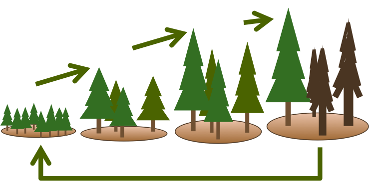

The University of Virginia Forest Model Enhanced (UVAFME), written in Fortran(90), is an update and extension of the individual-based gap model FAREAST  ([Yan & Shugart 2005](https://www.jstor.org/stable/3566334?seq=1#page_scan_tab_contents)) into an object-oriented flexible structure, allowing easier model modifications and enhancements.

UVAFME is an individual-based gap model that simulates the annual establishment, growth, and mortality of individual trees on independent patches (i.e. plots) of a forested landscape. The model is only spatially distributed in the vertical dimension, and plots are assumed to have no direct spatial interactions with one another. Through a Monte Carlo-style aggregation, the average of several hundred of these independent patches represents the average expected conditions of a forested landscape through time. As such, output from UVAFME is comparable to a statistically robust sampling of replicate forest inventory plots.

Climate is based on input distributions of monthly precipitation, temperature, and cloud cover, derived from the historical data record. Daily soil moisture and nutrient dynamics are simulated based on a coupled, two-layer soil submodule using input site and soil characteristics.

### Basic Structure

Individual tree growth for each year is calculated through optimal diameter increment growth, modified by available resources and species- and tree size-specific tolerances to temperature and permafrost (if present), and light, moisture, and nutrient availability. Individual trees can thus compete with one another for above- and belowground resources. Light availability throughout the canopy is calculated using the [Beer-Lambert Law](https://en.wikipedia.org/wiki/Beer%E2%80%93Lambert_law) and is dependent on the vertical distribution of leaf area within the plot.

Tree growth response to temperature is based on an asymptotic relationship between growth rate and annual growing degree-days. Drought response is based on an index that represents the proportion of the growing season that experiences soil moisture limitation and/or high atmospheric demand. Nutrient availability response is based on responses to a relative nitrogen availability variable, calculated by comparing plant-available N (simulated in the decomposition subroutine) to the required N that year. The final annual increment growth for each tree is determined by multiplying the smallest (i.e. most limiting) growth-limiting factor by the optimal increment growth. Establishment of seedlings and saplings is based on species-specific resources and environmental tolerances as well as plot conditions.

Trees may die from age- or growth stress-related factors or by disturbances (i.e. fire, windthrow, or insect infestation). Fire and windthrow occurrence are probabilistic, based on site-specific mean return intervals. Fire and windthrow mortality are based on intensity (for fire), as well as species- and size-specific tolerances. Insect infestation is based on tree- and stand-level factors that increase probability of infestation and mortality. Trees that die, as well as annual leaf litter and coarse woody debris are transferred to litter cohorts for decomposition.
