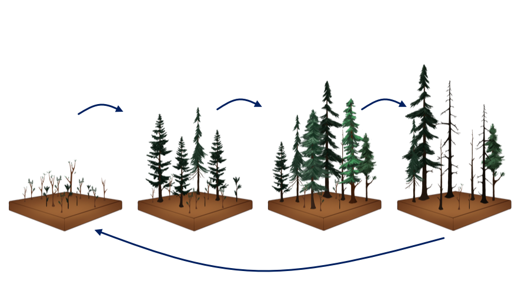

The University of Virginia Forest Model Enhanced (UVAFME), written in Fortran(90), is an update and extension of the individual-based gap model FAREAST ([Yan & Shugart 2005](https://www.jstor.org/stable/3566334?seq=1#page_scan_tab_contents)) into an object-oriented flexible structure, allowing easier model modifications and enhancements.

UVAFME is an individual-based gap model that simulates the annual establishment, growth, and death of individual trees on independent patches (i.e. plots) of a landscape. An average of several hundred of these patches simulates the average biomass and species composition of a forested landscape through time.

Climate is based on inputs of mean monthly precipitation, temperature, and cloudiness, derived from the historical data record. Soil moisture and soil nutrients are simulated based on a coupled, two-layer soil submodule using inputs of site and soil characteristics.

### Basic Structure

Individual tree growth for each year is calculated through optimal diameter increment growth, modified by available resources and species- and tree size-specific tolerances to temperature, permafrost (if present), and light, moisture, and nutrient availability. Individual trees can thus compete with one another for above- and below-ground resources. Light availability throughout the canopy is calculated using the [Beer-Lamber Law](https://en.wikipedia.org/wiki/Beer%E2%80%93Lambert_law) and is dependent on the vertical distribution of LAI within the plot. 

Tree growth response to temperature is based on an asymptotic relationship between growth rate and annual growing degree-days. Drought response is based on an index that represents the proportion of the growing season that experiences soil moisture limitation. The final annual increment growth for each tree is determined by multiplying the smallest (i.e. most limiting) growth-limiting factor by the optimal increment growth. Establishment of seedlings and saplings is based on species-specific resource and environmental tolerances.

UVAFME also simulates the response to fire, windthrow, and bark beetle disturbance, based on inputs of disturbance return interval (for fire and wind), and tree/stand characteristics. Trees may also die due to age- or stress-related factors. Trees that die, as well as leaf litter and coarse woody debris are transferred to the soil layers for decomposition simulation.
