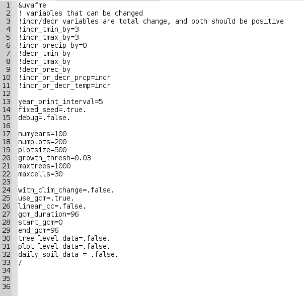

UVAFME is written in Fortran(90), and can be run on a Linux platform, and easily compiled on a Linux system with the [ifort](https://software.intel.com/en-us/fortran-compilers) compiler. Each site simulated in UVAFME is independent from other sites. Thus, when simulating multiple sites, UVAFME runs them in succession. This setup means that UVAFME simulations may be run "interactively" (i.e. from an active command line session), or distributed across several linux nodes via a job manager such as SLURM.

## Files Needed for Running UVAFME

In order to successfully run UVAFME, you must make sure all the necessary files are
present in the correct directories and with the correct naming system. You must have
these files/folders:

1. *UVAFME.exe* - this is the UVAFME executable file for the model
2. *file_list.txt* - this is a text file that tells the model where your input and
output directories are
3. **input_data** - this is the directory that contains all the input files
4. **output_data** - this is the directory that will contain the output files

### Input files needed

For a basic run, you must have these files present in your input directory:

1. *UVAFME2018_runtime.txt*
2. *UVAFME2018_sitelist.csv*
3. *UVAFME2018_site.csv*
4. *UVAFME2018_rangelist.csv*
5. *UVAFME2018_specieslist.csv*
6. *UVAFME2018_climate.csv*
7. *UVAFME2018_climate_stddev.csv*
8. *UVAFME2018_climate_ex.csv*
9. *UVAFME2018_climate_ex_stddev.csv*

An optional *UVAFME2018_climate_GCM.csv* file can be used for a non-linear climate change application (i.e. from a GCM file). These files must have this exact naming convention or UVAFME will not recognize them and
you will get an I/O runtime error.

## Running UVAFME

To run UVAFME interactively from the command line simply enter: `./UVAFME.exe file_list.txt`

This will run the model at each site specified in the Sitelist file, in order. Once the
model has finished running, the output files will be in the output_data directory. These
output files will be rewritten every time the model is run, so be sure to save them
elsewhere or with a different name (if desired) before re-running.

As mentioned above, the independence of the UVAFME sites allows for batches of sites to
be distributed across several nodes of a computing cluster. This can be done manually,
using different file_list.txt files which point the model to different input/output
directories. It can also be accomplished using a job manager such as SLURM. An example
SLURM script which will submit one job is as follows:

~~~~~
#!/bin/bash
#
echo "#!/bin/bash" >> job_1.slurm
echo "#SBATCH --ntasks=1" >> job_1.slurm
echo "#SBATCH --time=10:00:00" >> job_1.slurm
echo "#SBATCH --output=job_1.out" >> job_1.slurm
echo "#SBATCH --error=job_1.err" >> job_1.slurm
echo "./UVAFME.exe file_list_1.txt" >> job_1.slurm
sbatch job_1.slurm
~~~~~

This script can be modified by adding a loop which distributes several jobs (i.e. `job_$i.slurm`) with several different file lists (i.e. `file_list_$i.txt`), each with a separate set of input/output directories.

# Description of Input Files

### Runtime File

The _UVAFME2018_runtime.txt_ file sets up runtime parameters which are the same across all sites set up in the _UVAFME2018_sitelist.csv_ file. Such parameters include how many plots to simulate per site and their size, the number of years to run the simulations, as well as parameters for implementing climate change. The runtime file is a Fortran namelist file, thus the parameter names in the input runtime file must match the parameter names set up inside the model or an I/O error will occur, and the default values for all subsequent parameters will be used.

### Sitelist File

The *UVAFME2018_sitelist.csv* file sets up the sites to be run in a simulation, as well as site-specific parameters such as fire probability and intensity, windthrow probability, and elevation of a site. While each of these parameters is generally also present in the site file (*UVAFME2018_site.csv*) or is a default parameter in the model, the setup here allows for sites to be parameterized with "base" conditions in the Site file, and run with different parameters using the Sitelist file. This setup also allows the same site to be run multiple times with different parameters values (e.g. the same site run a multiple elevations). The Sitelist file must have the site IDs of each site to be run present in the **siteID** column, but all other columns may be left blank. Any other parameter left blank in the Sitelist file will take the values present in the Site file or default values in the model.

### Specieslist File

The _UVAFME2018_specieslist.csv_ file contains the species-level parameters for each species to be simulated. These parameters include average maximum age, DBH, and height, tolerance levels to shade, drought and nutrients, and seedling/seedbank parameters.

### Site File

The _UVAFME2018_site.csv_ file contains the site-specific parameters for each site, including latitude and longitude, topography, soil characteristics, disturbance probabilities, and values for modifying temperature and precipitation if the elevation of the site is changed (i.e. climatic lapse rates). As with all the files, the site ids in the **siteID** column must match the site ids in all other files.

### Rangelist File

The _UVAFME2018_rangelist.csv_ file determines which species are eligible for colonization and growth at each site. The column names are the species ids (8-character ids set up in the _UVAFME2018_specieslist.csv_ file), and the rows are each site. If a species is present at a site, the column/row will have a 1, and if the species is absent the column/row will have a 0.

This is the only csv file where the column names are explicitly read by UVAFME and must match the species ids as set up in the Specieslist file. The order must also match the order of the Specieslist file.

### Climate Files

The _UVAFME2018_climate.csv_, _UVAFME2018_climate_stddev.csv_, _UVAFME2018_climate.csv_, and _UVAFME2018_climate_stddev.csv_ files contain the average and standard deviations of monthly precipitation, cloud cover, and minimum and maximum temperature for each site. These data are generally derived from at least 30 years of historical climate data and are used to generate monthly and daily weather within UVAFME.

## More Information

For a more in depth description of how to modify, compile, and run UVAFME check out the How To Guide on the [UVAFME GitHub page](https://github.com/UVAFME/UVAFME_model).
