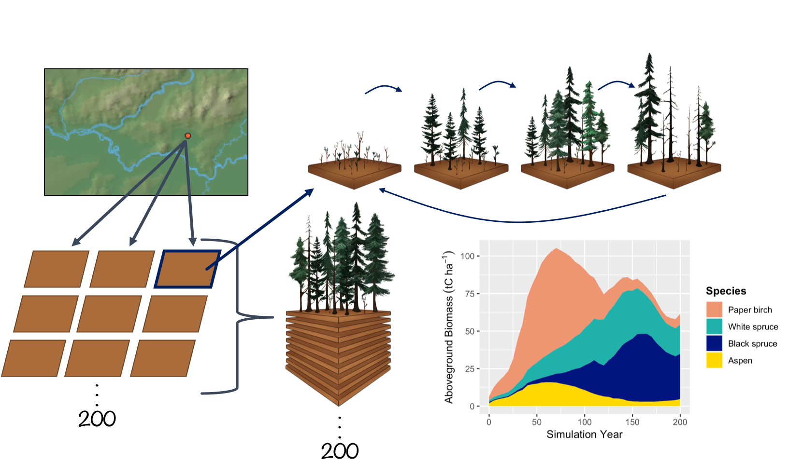
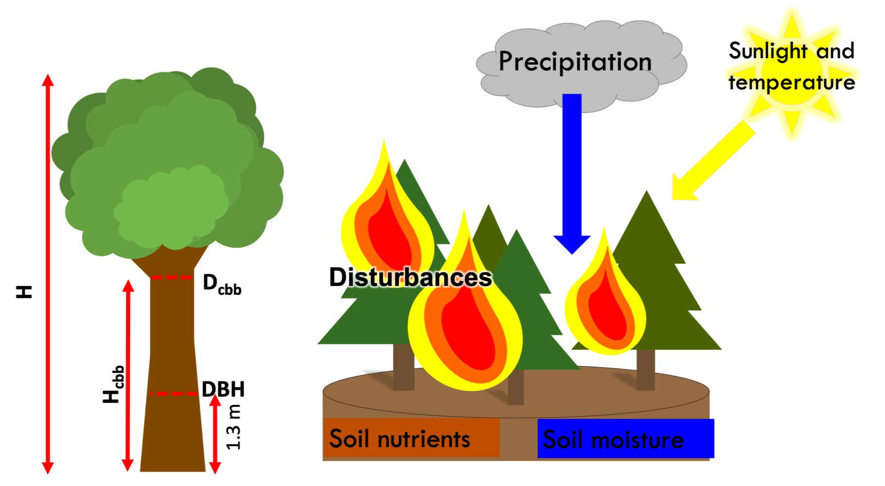

Details about processes within the model can be found below. For an extremely detailed look at all equations and processes within UVAFME check out the User's Manual available on the [UVAFME GitHub page](https://github.com/UVAFME/UVAFME_model).

#### Jump to a specific topic
1. [Scale and Spatial Interaction](#scale)
2. [Climate](#climate)
3. [Soil Processes](#soil)
4. [Moss](#moss)
5. [Tree Growth](#tgrowth)
6. [Tree Mortality](#tmort)
7. [Tree Regeneration](#regen)

# Scale and Spatial Interaction 

Currently, UVAFME sites do not interact with one another and thus may be run in parallel or in sequence. Within a site, several hundred (generally 200) independent plots about the area of influence of a dominant tree crown (e.g. 500 m2) are simulated that represent patches of a forested landscape. Forest "landscape" in this context is defined as a dynamic mosaic of forest gaps (i.e. patches/plots) (see [Shugart and Seagle 1985](https://www.researchgate.net/publication/282756658_Modeling_Forest_Landscapes_and_the_Role_of_Disturbance_in_Ecosystems_and_Communities)). Within each patch, gap dynamics play out through the establishment of new trees following some major disturbance, growth and competition between trees to fill in the gap,  eventual dominance or co-dominance of a few trees, and death of such canopy dominants, which starts the cycle anew. Within UVAFME, the plots do not interact with one another, and thus represent independent replicates of potential forest dynamics occurring at a location with input environmental and climatological conditions. Due to the stochastic factors within UVAFME (i.e. disturbances, mortality, and regeneration), each plot will contain a forest patch undergoing some gap dynamics process, driven by both deterministic processes (e.g. tree growth response to external factors) and stochastic factors. A Monte Carlo-style average of such plots thus represents average, non-spatially explicit, per area *expected* forested conditions for the site location. This aggregation also produces emergent properties at the landscape scale (i.e. the average of several hundred gaps) such as forest succession, cyclical effects, and response to shifting climate and disturbance regimes.

Climate and daily weather conditions in UVAFME are the same across all plots within a site, thus each plot experiences the same temperature, precipitation, cloud cover, and PET each simulation day. As of Version 3 of UVAFME, soil conditions within each plot are independent of one another, driven by the site-wide factors such as climate and input/initial soil conditions, as well as plot-specific factors such as forest cover and disturbances. Additionally, within each plot individual trees are placed on a 30x30 grid, but only interact spatially with one another with respect to insect infestation. Each plot is assumed to be horizontally (but not vertically) homogenous with respect to canopy cover and leaf area, seed rain and seedling banks, as well as soil conditions.

# Climate 

Climate in UVAFME is simulated through input distributions of monthly temperature (ºC), precipitation (cm), and cloud cover (tenths of sky covered). The average monthly minimum and maximum temperatures, precipitation, and cloud cover, as well as standard deviations for these values (generally derived from at least 30 years of historical climate data) are used to create a range of possible values for a site in question. These monthly values are generated anew for each year of the simulation on each site and are equal across all plots within a site.

The monthly simulated weather data are used to generate daily values for each simulation year using a Gaussian approach for temperature and cloud cover. To generate daily precipitation values, the monthly precipitation is used to calculate the number of days it rains that month, and the amount of rainfall for each rain day. Monthly rain days are distributed randomly across the days in the month until all rain days have been filled.

### Climate Change
Climate change can be prescribed either linearly or via an input climate change file. Climate change, in the form of changing mean monthly temperatures and precipitation, is achieved by modifying the input values of average monthly minimum and maximum temperatures  and precipitation for a simulated site. Currently, all cloudiness variables and all monthly standard deviations do not change from the historical inputs during the climate change application.

### Altitudinal Change
Often it is beneficial to run the model at the same site latitude and longitude, but at different elevations (such as in studies in complex terrain for for testing applications). Both temperature and precipitation change as altitude/elevation changes. These changes can be generated in UVAFME using input values of the base site elevation, the new elevation (i.e. altitude), and temperature and precipitation lapse rates. As with climate change, these modifications are made to the initial input average minimum and maximum temperatures and precipitation for a particular site.

### Solar Radiation
Daily and annual solar radiation is used to calculate potential evapotranspiration (PET) and permafrost dynamics (if present) within UVAFME. Previous versions of the model used top-of-atmosphere solar radiation to derive PET, however as of Version 3, surface solar radiation is used to account for the effects of slope, aspect, and cloud cover on solar radiation received at a surface.

### Potential Evapotranspiration
In previous versions of UVAFME, top-of-atmosphere radiation was used to calculate potential evapotranspiration (PET) using Hargreave's evaporation formula, however, studies have shown this equation to overestimate PET at high latitudes. As of Version 3, the formulation for PET was updated to use a modified Priestley-Taylor equation which uses surface solar radiation, allowing for the incorporation of topographic effects on PET.

# Soil Processes 

### Soil Water

Soil water balance in UVAFME is partitioned into two layers, a moss-organic layer containing a mixture of moss, humus, and litter, and a mineral layer. Outputs are aggregated over the year to influence yearly tree growth. Using this simple model allows for relatively little inputs: slope, canopy LAI, organic layer depth, drainage quality, soil texture, PET, and precipitation. These inputs are received from site input variables, the tree Canopy module, the soil nutrient submodel, and the Climate module.

As of Version 3 of UVAFME permafrost depth effects on soil moisture dynamics are also incorporated (if permafrost is present) using equations adapted from [Bonan (1989)](https://www.sciencedirect.com/science/article/pii/0304380089900768). Each day in the simulation, soil moisture is partitioned into liquid and frozen water in each soil layer, based on the calculation of depths of freezing and thawing in the permafrost submodel.  For areas with continuous or discontinuous permafrost, it is assumed that the moss-organic and mineral layers are above field capacity at the beginning of each year. This effect of near-saturated conditions on moisture dynamics is implemented via drainage condition variables, which are set up at the beginning of each simulation year, based on the previous years' maximum depth of thaw.

### Soil and Litter Decomposition

In previous versions of UVAFME, any trees that died and all annual litterfall were added to site-wide pools of C and N, regardless of litter type (i.e. boles, leaves, etc.) or species. These C and N amounts along with temperature and soil moisture were used to calculate soil respiration and plant-available nitrogen. As of UVAFME Version 3,  the model allows for fine-scale interactions between climate, soils, vegetation, and disturbances through explicit tracking and decomposition of individual forest litter "cohorts" based on equations adapted from [Bonan (1990)](https://link.springer.com/article/10.1007/BF00000889) and [Pastor and Post (1985)](https://www.researchgate.net/publication/236392775_Development_of_a_linked_forest_productivity-soil_process_model). Within the simulation, any litter from branch thinning, annual leaf-off, or tree mortality is added to a litter array along with moss litter, depending on its type and genus (for leaf litter). Litter is accumulated within the array throughout each simulation year and decomposed the following year depending on litter and site characteristics.

### Permafrost

The daily depths of freeze and thaw are calculated in the permafrost subroutine using the Stefan equation as in [Bonan (1989)](https://www.sciencedirect.com/science/article/pii/0304380089900768), by determining the required number of monthly cumulative degree-days to freeze or thaw each soil layer completely, and the actual number of available monthly degree-days for freezing/thawing, which are modified via topographic and forest cover factors. The annual maximum depth of thaw is used to impact individual tree growth each year based on species-specific permafrost tolerance.

## Moss 

Moss growth and decay is calculated as in [Bonan and Korzukhin (1989)](https://www.jstor.org/stable/20038509?seq=1#metadata_info_tab_contents), where moss growth is modeled as the difference between carbon assimilation and decay/respiration. Carbon assimilation is assumed to be proportional to maximum moss biomass reported for the simulation region, and is modified based on plot conditions such as light conditions, soil moisture, and tree litterfall.

# Tree Growth 

Tree growth in UVAFME is modeled annually as diameter increment growth, based on first simulating optimal diameter increment growth and subsequently modifying that optimal growth based on environmental conditions and species- and tree size-specific tolerances. Each year the updated diameter is used to calculate other tree characteristics such as height, leaf area, and biomass, using allometric equations.

### Tree Allometry

Optimal diameter growth of a tree is calculated as a function of current tree DBH, and species-specific parameters such as average maximum DBH, height, and age. Tree height is calculated based on an equation from the [FORSKA model](https://books.google.com/books/about/FORSKA_a_General_Forest_Succession_Model.html?id=kyLEtgAACAAJ). Leaf area is calculated as a function of the diameter at clear branch bole height, based on the [Shinozaki pipe model](https://www.researchgate.net/publication/301967992_A_quantitative_analysis_of_plant_form_the_pipe_model_theory_II_Further_evidence_of_the_theory_and_its_application_in_forest_ecology).

 In UVAFME, clear branch bole height is not calculated allometrically but set to an initial value (1.0 m) when a tree is first initialized, and then allowed to increase annually (or not) via lower branch thinning. Wood volume (i.e. biomass) is calculated assuming the bole shape is a simple cone. This volume is then multiplied by the bulk density of the wood (a species-specific input parameter) and divided by 2 to derive biomass in tonnes of C. Biomass of branches and the bole above the diameter at clear branch bole height is calculated also assuming the volume is a cone and applying similar scaling factors to derive tonnes of C. The lateral root volume is assumed to be half of the branch volume, and the root ball volume is calculated by assuming a cone at DBH height downwards to the root depth.

### Annual Growth

 Annual tree growth is simulated using the above allometric equations for growth, modified by the current environmental conditions on the plot as well as species- and tree size-specific tolerances. Optimal diameter increment growth is decremented based on soil moisture, temperature, light conditions, nutrient availability, and permafrost conditions (if present). For each of these potential stressors, growth factors are calculated (0 to 1) on a species- and tree-level basis and used to decrement the optimal growth of each tree to derive actual diameter increment growth. For a given plot on a given year, the environmental conditions determine how well each individual tree grows that year. Thus, trees of differing species and sizes will respond differently each year and can compete with one another for resources.

# Tree Mortality 

Trees in UVAFME may die from stress- or age-related factors or from disturbances by wildfire, windthrow, and [bark beetles](https://esajournals.onlinelibrary.wiley.com/doi/full/10.1002/ecs2.2437). Growth stress-related mortality is calculated via prolonged low diameter increment growth. Trees also have a chance of dying each year based on the input species-specific probability of reaching its maximum age.

Each plot run for a specific site has a probability of fire or windthrow occurring each year, independent from other plots and other sites. Fire probability is additionally connected to climate via an aridity index. If a fire occurs on a plot, the amount of litter and the moisture conditions on the plot are used to calculate the scorch height and crown scorch and cambial damage-related mortality of each individual tree.

If a windthrow event occurs on the plot, probability of windthrow mortality of each individual tree on the plot is based on tree size. UVAFME is also able to simulate mortality from the spruce beetle (*Dendroctonus rufipennis* (Kirby)), a bark beetle which infests spruce (*Picea spp.*) species. Mortality is simulated as the probability of infestation of each host tree based on climate-, site-, and tree-level characteristics ([Foster et al. 2018](https://esajournals.onlinelibrary.wiley.com/doi/full/10.1002/ecs2.2437)).

### Litter
Trees that die and any annual litter is placed in appropriate genus- and litter type-specific litter cohorts for decomposition. Leaf litter biomass is added to a genus-specific annual litter pool, and twig litter and root litter are added to a twig litter and root litter pool, respectively. Tree boles are separated into small bole litter (DBH < 10 cm) and large bole litter (DBH > 10 cm). If a fire occurs on the plot the litter and humus layers are also consumed, depending on litter and site moisture conditions.

# Tree Regeneration 

Annual establishment of new trees in UVAFME is based on the species-specific seed and seedling banks on each plot as well as the current environmental conditions and species-specific tolerances. Similar to other gap models, the species of each new tree established is stochastic, weighted by each species' ability to survive in the current plot's environment. The seedbank and seedling bank of each species is additionally modified to account for seeding strategies (i.e. serotiny, sprouting etc.) and natural mortality of seeds and seedlings.

Trees in UVAFME are located on a grid (generally 30x30). Currently, trees within the same plot interact spatially with one another with respect to insect infestation. When a new tree is established, its x/y location on the grid is drawn randomly from the set of empty grid spaces on the plot. The tree then carries this same grid cell location throughout its lifetime until its death, at which point that grid cell is once again empty.

### Further Reading and Citations

1. Bonan, G. . 1989. A computer model of the solar radiation, soil moisture, and soil thermal regimes in boreal forests. Ecological Modelling 45:275–306.
2. Bonan, G. B. 1990. Carbon and nitrogen cycling in North American boreal forests I. Litter quality and soil thermal effects in interior Alaska. Biogeochemistry 10:1–28.
3. Bonan, G. B., and M. D. Korzukhin. 1989. Simulation of moss and tree dynamics in the boreal forests of interior Alaska. Vegetatio 84:31–44.
4. Botkin, D. B., J. F. Janak, and J. R. Wallis. 1972. Some Ecological Consequences of a Computer Model of Forest Growth. The Journal of Ecology 60:849.
5. Foster, A. C., J. K. Shuman, H. H. Shugart, and J. Negron. 2018. Modeling the interactive effects of spruce beetle infestation and climate on subalpine vegetation. Ecosphere 9:e02437.
6. Leemans, R., and I. C. Prentice. 1989. FORSKA, a general forest succession model. Institute of Ecological Botany, Uppsala, Sweden.
7. Pastor, J., and W. M. Post. 1985. Development of a linked forest productivity-soil process model. Page 108. Environmental Sciences Division Publication, USDA, Oak Ridge National Laboratory.
8. Shinozaki, K., K. Yoda, K. Hozumi, and T. Kira. 1964. A quantitative analysis of plant form - the pipe model theory. I. Basic analysis. Japanese Journal of Ecology 14:19–105.
9. Shugart, H. H., and S. W. Seagle. 1985. Modeling forest landscapes and the role of disturbance in ecosystems and communities. Pages 353–368 in S. T. A. Pickett and P. S. White, editors. The Ecology of Natural Disturbance and Patch Dynamics. Elsevier.
Yan, X., and H. H. Shugart. 2005. FAREAST: a forest gap model to simulate dynamics and patterns of eastern Eurasian forests: Simulation of eastern Eurasian forests. Journal of Biogeography 32:1641–1658.
