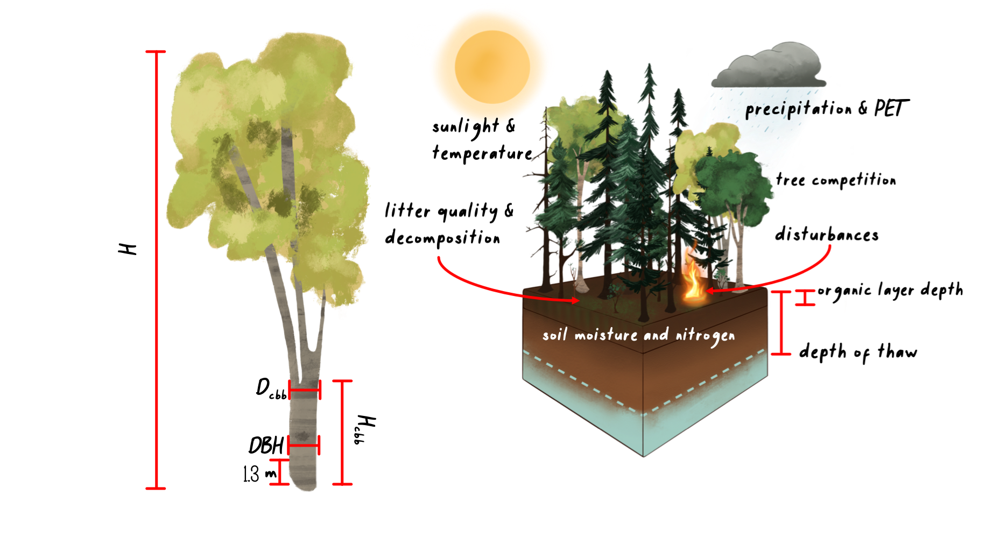

# Scale and Spatial Interaction

Currently, UVAFME sites do not interact with one another and thus may be run in parallel or in sequence. Within a site, several hundred (generally 200) independent plots about the area of influence of a dominant tree crown (e.g. 500 m2) are simulated that represent patches of a forested landscape. Forest "landscape" in this context is defined as a dynamic mosaic of forest gaps (i.e. patches/plots) (see [Shugart and Seagle 1985](https://www.researchgate.net/publication/282756658_Modeling_Forest_Landscapes_and_the_Role_of_Disturbance_in_Ecosystems_and_Communities)). Within each patch, gap dynamics play out through the establishment of new trees following some major disturbance, growth and competition between trees to fill in the gap,  eventual dominance or co-dominance of a few trees, and death of such canopy dominants, which starts the cycle anew. Within UVAFME, the plots do not interact with one another, and thus represent independent replicates of potential forest dynamics occurring at a location with input environmental and climatological conditions. Due to the stochastic factors within UVAFME (i.e. disturbances, mortality, and regeneration), each plot will contain a forest patch undergoing some gap dynamics process, driven by both deterministic processes (e.g. tree growth response to external factors) and stochastic factors. A Monte Carlo-style average of such plots thus represents average, non-spatially explicit, per area *expected* forested conditions for the site location. This aggregation also produces emergent properties at the landscape scale (i.e. the average of several hundred gaps) such as forest succession, cyclical effects, and response to shifting climate and disturbance regimes.

Climate and daily weather conditions in UVAFME are the same across all plots within a site, thus each plot experiences the same temperature, precipitation, cloud cover, and PET each simulation day. As of Version 3 of UVAFME, soil conditions within each plot are independent of one another, driven by the plot-wide factors such as climate and input/initial soil conditions, as well as plot-specific factors such as forest cover and disturbances. Additionally, within each plot individual trees are placed on a 30x30 grid, but only interact spatially with one another with respect to insect infestation. Each plot is assumed to be horizontally (but not vertically) homogenous with respect to canopy cover and leaf area, seed rain and seedling banks, as well as soil conditions.

# Climate

Climate in UVAFME is simulated through input distributions of monthly temperature (ºC), precipitation (cm), and cloud cover (tenths of sky covered). The average monthly minimum and maximum temperatures, precipitation, and cloud cover, as well as standard deviations for these values (generally derived from at least 30 years of historical climate data) are used to create a range of possible values for a site in question. These monthly values are generated anew for each year of the simulation on each site and are equal across all plots within a site.

The monthly simulated weather data are used to generate daily values for each simulation year using a Gaussian approach for temperature and cloud cover. To generate daily precipitation values, the monthly precipitation is used to calculate the number of days it rains that month, and the amount of rainfall for each rain day. Monthly rain days are distributed randomly across the days in the month until all rain days have been filled.

## Climate Change
Climate change can be prescribed either linearly or via an input climate change file. Climate change, in the form of changing mean monthly temperatures and precipitation, is achieved by modifying the input values of average monthly minimum and maximum temperatures  and precipitation for a simulated site. Currently, all cloudiness variables and all monthly standard deviations do not change from the historical inputs during the climate change application.

## Altitudinal Change
Often it is beneficial to run the model at the same site latitude and longitude, but at different elevations (such as in studies in complex terrain for for testing applications). Both temperature and precipitation change as altitude/elevation changes. These changes can be generated in UVAFME using input values of the base site elevation, the new elevation (i.e. altitude), and temperature and precipitation lapse rates. As with climate change, these modifications are made to the initial input average minimum and maximum temperatures and precipitation for a particular site.

## Solar Radiation
Daily and annual solar radiation is used to calculate potential evapotranspiration (PET) and permafrost dynamics (if present) within UVAFME. Previous versions of the model used top-of-atmosphere solar radiation to derive PET, however as of Version 3, surface solar radiation is used to account for the effects of slope, aspect, and cloud cover on solar radiation received at a surface.

## Potential Evapotranspiration
In previous versions of UVAFME, top-of-atmosphere radiation was used to calculate potential evapotranspiration (PET) using Hargreave's evaporation formula, however, studies have shown this equation to overestimate PET at high latitudes. In this version of the model, the formulation for PET was updated to use a modified Priestley-Taylor equation which uses surface solar radiation, allowing for the incorporation of topographic effects on PET.

# Soil Processes

## Soil Water

Soil water balance in UVAFME is partitioned into two layers, a moss-organic layer containing a mixture of moss, humus, and litter, and a mineral layer. Outputs are aggregated over the year to influence yearly tree growth. Using this simple model allows for relatively little inputs: slope, canopy LAI, organic layer depth, drainage quality, soil texture, PET, and precipitation. These inputs are received from site input variables, the tree Canopy module, the soil nutrient submodel, and the Climate module.

As of Version 3 of UVAFME permafrost depth effects on soil moisture dynamics are also incorporated (if permafrost is present) using equations adapted from [Bonan (1989)](https://www.sciencedirect.com/science/article/pii/0304380089900768). Each day in the simulation, soil moisture is partitioned into liquid and frozen water in each soil layer, based on the calculation of depths of freezing and thawing in the permafrost submodel.  For areas with continuous or discontinuous permafrost, it is assumed that the moss-organic and mineral layers are above field capacity at the beginning of each year. This effect of near-saturated conditions on moisture dynamics is implemented via drainage condition variables, which are set up at the beginning of each simulation year, based on the previous' years maximum depth of thaw.

## Soil and Litter Decomposition

In previous versions of UVAFME, any trees that died and all annual litterfall were added to site-wide pools of C and N, regardless of litter type (i.e. boles, leaves, etc.) or species. These C and N amounts along with temperature and soil moisture were used to calculate soil respiration and plant-available nitrogen. As of UVAFME Version 3,  the model allows for fine-scale interactions between climate, soils, vegetation, and disturbances through explicit tracking and decomposition of individual forest litter "cohorts" based on equations adapted from [Bonan (1990)](https://link.springer.com/article/10.1007/BF00000889) and [Pastor and Post (1985)](https://www.researchgate.net/publication/236392775_Development_of_a_linked_forest_productivity-soil_process_model). Within the simulation, any litter from branch thinning, annual leaf-off, or tree mortality is added to a litter array along with moss litter, depending on its type and genus (for leaf litter). Litter is accumulated within the array throughout each simulation year and decomposed the following year depending on
litter and site characteristics.

## Permafrost

The daily depths of freeze and thaw are calculated in the permafrost subroutine using the Stefan equation as in [Bonan (1989)](https://www.sciencedirect.com/science/article/pii/0304380089900768), by determining the required number of monthly cumulative degree-days to freeze or thaw each soil layer completely, and the actual number of available monthly degree-days for freezing/thawing, which are modified via topographic and forest cover factors. The annual maximum depth of thaw is used to impact individual tree growth each year based on species-specific permafrost tolerance.

# Moss

Moss growth and decay is calculated as in [Bonan and Korzukhin 1989](https://www.jstor.org/stable/20038509?seq=1#metadata_info_tab_contents), where moss growth is modeled as the difference between carbon assimilation and decay/respiration. Carbon assimilation is assumed to be proportional to maximum moss biomass reported for the simulation region, and is modified based on plot conditions such as light conditions, soil moisture, and tree litterfall.

# Tree Growth

Tree growth in UVAFME is modeled annually as diameter increment growth, based on first simulating optimal diameter increment growth and subsequently modifying that optimal growth based on environmental conditions and species- and tree size-specific tolerances. Each year the updated diameter is used to calculate other tree characteristics such as height, leaf area, and biomass, using allometric equations.

Optimal diameter growth of a tree is calculated as in [Botkin et al. 1972](https://www.jstor.org/stable/2258570?seq=1#metadata_info_tab_contents):

\begin{equation} \label{opt}
\delta DBH_{opt} = gDBH\frac{1.0 - \frac{H}{DBH_{max}/H_{max}}}{2.0H + sDBH\text{e}^{\frac{-sDBH}{H_{max} - 1.3}}}
\end{equation}

where $H$ is the current tree height (m), $DBH$ is the current diameter at breast height (cm), $H_{max}$ is the species' average maximum height (m), $DBH_{max}$ is the species' average maximum DBH (cm), and $s$ and $g$ are species-specific growth parameters. 
